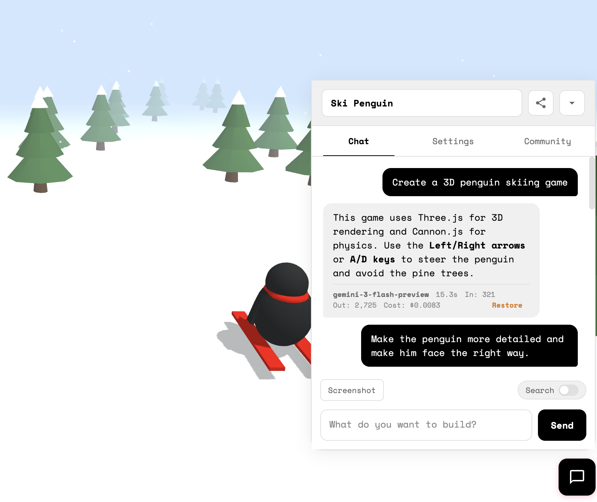

# Vibey

**Vibe code in your browser.**

Try it live: [https://martinpllu.github.io/vibey](https://martinpllu.github.io/vibey)

(Requires an [OpenRouter](https://openrouter.ai) account for model access)



**Features:**
- Use multiple AI models via OpenRouter (Gemini 3 Flash is cheap and works really well)
- All data stored locally in your browser - nothing sent to any server except OpenRouter
- Create multiple apps with separate chats
- Token usage and cost tracking
- Restore previous versions of code
- Attach console logs and screenshots to messages for easy debugging
- Community gallery to share and discover apps

Try it at [https://martinpllu.github.io/vibey](https://martinpllu.github.io/vibey)

## How it works

Vibey is a single HTML file with no backend. Here's what's happening under the hood:

- **Code execution**: Generated HTML/JS runs in a sandboxed iframe using `srcdoc`. A bridge script injected into the iframe captures errors and console logs via `postMessage`.
- **Storage**: Apps and chat history are stored in IndexedDB. Settings use localStorage.
- **AI integration**: Calls go directly to OpenRouter's API from the browser. Only the latest code is sent to the model – older versions are replaced with placeholders to reduce token usage.
- **Screenshots**: For canvas-based apps (games), screenshots grab the canvas directly via `toDataURL()`. For regular HTML, it falls back to html2canvas.
- **Auth security**: As a security measure, your OpenRouter API key is stored in memory only (not localStorage) so that the code running in the iframe can't access it. You'll re-authenticate each session – it's a one-click OAuth flow.

## Running Locally

```bash
python3 -m http.server 8000
```

Then open http://localhost:8000 in your browser.
